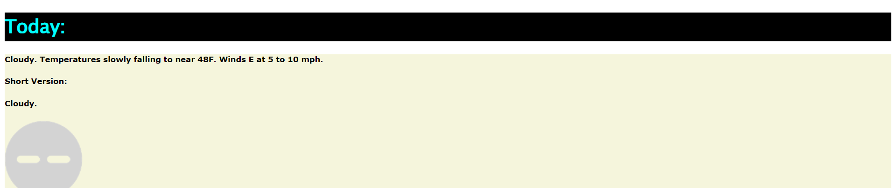

<h1>This is a script from another respitory of mine (Washington-Weather/my-scripts). I am currently trying to get the icon to function.</h1>

<h3>Preview</h3>
 
For Small TWC Script:
  Tasks:
  
Full Design: ❌

  
Working Forecasts: ✅
   
  
Working Search Query: ❌

  
Working Icons: ❌

For Large TWC Script:
  
Full Design: 🟠

  
Working Conditons: ✅
   
  
Working Search Query: ❌

  
Working Icons: ❌

